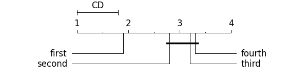

.. py:currentmodule:: Arithmos.evaluation.scoring

#############################
Scoring methods (``scoring``)
#############################

CA
--

.. index:: CA
.. autofunction:: Arithmos.evaluation.CA

Precision
---------

.. index:: Precision
.. autofunction:: Arithmos.evaluation.Precision

Recall
------

.. index:: Recall
.. autofunction:: Arithmos.evaluation.Recall

F1
--

.. index:: F1
.. autofunction:: Arithmos.evaluation.F1

PrecisionRecallFSupport
-----------------------

.. index:: PrecisionRecallFSupport
.. autofunction:: Arithmos.evaluation.PrecisionRecallFSupport

AUC
--------

.. index:: AUC
.. autofunction:: Arithmos.evaluation.AUC

Log Loss
--------

.. index:: Log loss
.. autofunction:: Arithmos.evaluation.LogLoss

MSE
---

.. index:: MSE
.. autofunction:: Arithmos.evaluation.MSE

MAE
---

.. index:: MAE
.. autofunction:: Arithmos.evaluation.MAE

R2
--

.. index:: R2
.. autofunction:: Arithmos.evaluation.R2

CD diagram
----------

.. index:: CD diagram

.. autofunction:: Arithmos.evaluation.compute_CD
.. autofunction:: Arithmos.evaluation.graph_ranks

Example
=======

    >>> import Arithmos
    >>> import matplotlib.pyplot as plt
    >>> names = ["first", "third", "second", "fourth" ]
    >>> avranks =  [1.9, 3.2, 2.8, 3.3 ]
    >>> cd = Arithmos.evaluation.compute_CD(avranks, 30) #tested on 30 datasets
    >>> Arithmos.evaluation.graph_ranks(avranks, names, cd=cd, width=6, textspace=1.5)
    >>> plt.show()

The code produces the following graph:

