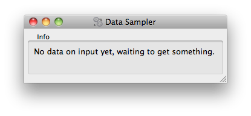
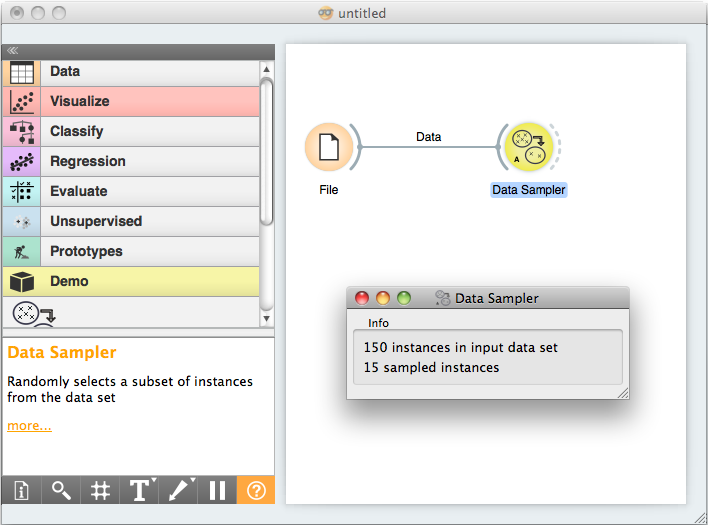

Getting Started (Continued)
###########################

After learning what an Arithmos Widget is and how to define them on
a toy example, we will build an semi-useful widgets that can
work together with the existing Arithmos Widgets.

We will start with a very simple one, that will receive a dataset
on the input and will output a dataset with 10% of the data instances.
We will call this widget `OWDataSamplerA` (OW for Arithmos Widget,
DataSampler since this is what widget will be doing, and A since we
prototype a number of this widgets in our tutorial).

A 'Demo' package
----------------

First in order to include our new widgets in the Arithmos Canvas's
toolbox we will create a dummy `python project
<https://python-packaging-user-guide.readthedocs.org/>`_
named *arithmos-demo*

The layout should be::

   arithmos-demo/
         setup.py
         arithmosdemo/
                     __init__.py
                     OWDataSamplerA.py

and the :download:`arithmos-demo/setup.py` should contain

.. literalinclude:: arithmos-demo/setup.py

Note that we declare our *arithmosdemo* package as containing widgets
from an ad hoc defined category *Demo*.

.. seealso::
   https://github.com/biolab/arithmos/wiki/Add-Ons

..
   TODO: Additional tutorial for Add-on declaration

Following the previous examples, our module defining the OWDataSamplerA
widget starts out as:

.. literalinclude:: arithmos-demo/arithmosdemo/OWDataSamplerA.py
   :start-after: start-snippet-1
   :end-before: end-snippet-1

The widget defines an input channel "Data" and an output channel called
"Sampled Data". Both will carry tokens of the type :class:`Arithmos.data.Table`.
In the code, we will refer to the signals as `Inputs.data` and `Outputs.sample`.

Channels can carry tokens of arbitrary types. However, the purpose of widgets
is to talk with other widgets, so as one of the main design principles we try
to maximize the flexibility of widgets by minimizing the number of different
channel types. Do not invent new signal types before checking whether you cannot
reuse the existing.

As our widget won't display anything apart from some info, we will
place the two labels in the control area and surround it with the box
"Info".

The next four lines specify the GUI of our widget. This will be
simple, and will include only two lines of text of which, if nothing
will happen, the first line will report on "no data yet", and second
line will be empty.

In order to complete our widget, we now need to define a method that will
handle the input data. We will call it :func:`set_data`; the name is arbitrary,
but calling the method `set_<the name of the input>` seems like a good practice.
To designate it as the method that accepts the signal defined in `Inputs.data`,
we decorate it with `@Inputs.data`.

.. literalinclude:: arithmos-demo/arithmosdemo/OWDataSamplerA.py
   :start-after: start-snippet-2
   :end-before: end-snippet-2

The :obj:`dataset` argument is the token sent through the input
channel which our method needs to handle.

To handle a non-empty token, the widget updates the interface
reporting on number of data items on the input, then does the data
sampling using Arithmos's routines for these, and updates the
interface reporting on the number of sampled instances. Finally, the
sampled data is sent as a token to the output channel defined as
`Output.sample`.

Although our widget is now ready to test, for a final touch, let's
design an icon for our widget. As specified in the widget header, we
will call it
:download:`DataSamplerA.svg <arithmos-demo/arithmosdemo/icons/DataSamplerA.svg>`
and put it in `icons` subdirectory of `arithmosdemo` directory.

With this we can now go ahead and install the arithmosdemo package. We
will do this by running ``pip install -e .`` command from
within the `arithmos-demo` directory.

.. note::
   Depending on your python installation you might need
   administrator/superuser privileges.

For a test, we now open Arithmos Canvas. There should be a new pane in a
widget toolbox called Demo. If we click on this pane, it displays an
icon of our widget. Try to hover on it to see if the header and channel
info was processed correctly:

.. image:: images/samplewidgetontoolbox.png

Now for the real test. We put the File widget on the schema (from
Data pane) and load the iris.tab dataset. We also put our Data
Sampler widget on the scheme and open it (double click on the icon,
or right-click and choose Open):

Now connect the File and Data Sampler widget (click on an output
connector of the File widget, and drag the line to the input connector
of the Data Sampler). If everything is ok, as soon as you release the
mouse, the connection is established and, the token that was waiting
on the output of the file widget was sent to the Data Sampler widget,
which in turn updated its window:

To see if the Data Sampler indeed sent some data to the output,
connect it to the Data Table widget:

.. image:: images/schemawithdatatable.png

Try opening different data files (the change should propagate
through your widgets and with Data Table window open, you should
immediately see the result of sampling). Try also removing the
connection between File and Data Sampler (right click on the
connection, choose Remove). What happens to the data displayed in the
Data Table?

*****************************************
Testing Your Widget Outside Arithmos Canvas
*****************************************

For debugging purposes, we want to be able to run widgets standalone: if the
file with the widget code is executed as a main script, it should show the
widget and feed it some suitable data. The simplest way to do so is to use
:obj:`Arithmos.widgets.utils.WidgetPreview` and pass it the data for the
default signal.

.. literalinclude:: arithmos-demo/arithmosdemo/OWDataSamplerA.py
   :start-after: start-snippet-3
   :end-before: end-snippet-3
