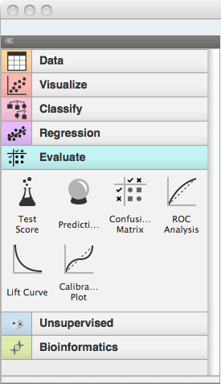

.. _getting started:

###############
Getting Started
###############

Arithmos Widgets are components in Arithmos Canvas, a visual programming
environment of Arithmos. They represent some self contained functionalities and
provide a graphical user interface (GUI). Widgets communicate with each other and
pass objects through communication channels to interact with other
widgets.

On this page, we will start with some simple essentials, and then
show you how to build a simple widget that will be ready to run within
Arithmos Canvas.

Prerequisites
*************

Each Arithmos widget belongs to a category and has an associated priority
within that category. When opening Arithmos Canvas, a visual
programming environment that comes with Arithmos, widgets are listed in
a toolbox on the left:

Each widget has a name description and a set of input/outputs
(referred to as the widget's meta description).

This meta data is discovered at Arithmos Canvas application startup
leveraging setuptools/distribute and its `entry points`_ protocol.
Arithmos Canvas looks for widgets using an ``arithmos.widgets`` entry point.

.. _`entry points`: https://pythonhosted.org/setuptools/setuptools.html#dynamic-discovery-of-services-and-plugins

Defining a widget
*****************

:class:`~Arithmos.widgets.widget.OWWidget` is the base class of a widget
in the Arithmos Canvas workflow.

Every widget in the canvas framework needs to define its meta data.
This includes the widget's name and text descriptions and more
importantly its input/output specification. This is done by
defining constants in the widget's class namespace.

We will start with a very simple example. A widget that will output
a single integer specified by the user.

.. code-block:: python

    from Arithmos.widgets.widget import OWWidget, Output
    from Arithmos.widgets.settings import Setting
    from Arithmos.widgets import gui

    class IntNumber(OWWidget):
        # Widget's name as displayed in the canvas
        name = "Integer Number"
        # Short widget description
        description = "Lets the user input a number"

        # An icon resource file path for this widget
        # (a path relative to the module where this widget is defined)
        icon = "icons/number.svg"

        # Widget's outputs; here, a single output named "Number", of type int
        class Outputs:
            number = Output("Number", int)

By design principle, Arithmos widgets in an interface are most
often split to control and main area. Control area appears on the left
and should include any controls for settings or options that your widget
will use. Main area would most often include a graph, table or some
drawing that will be based on the inputs to the widget and current
options/setting in the control area.
:class:`~Arithmos.widgets.widget.OWWidget` makes these two areas available
through its attributes :obj:`self.controlArea` and :obj:`self.mainArea`.
Notice that while it would be nice for all widgets to have this common
visual look, you can use these areas in any way you want, even
disregarding one and composing your widget completely unlike the
others in Arithmos.

We specify the default layout with class attribute flags.
Here we will only be using a single column (controlArea) GUI.

.. code-block:: python

       # Basic (convenience) GUI definition:
       #   a simple 'single column' GUI layout
       want_main_area = False
       #   with a fixed non resizable geometry.
       resizing_enabled = False

We want the current number entered by the user to be saved and restored
when saving/loading a workflow. We can achieve this by declaring a
special property/member in the widget's class definition like so:

.. code-block:: python

       number = Setting(42)

And finally the actual code to define the GUI and the associated
widget functionality:

.. code-block:: python

       def __init__(self):
           super().__init__()

           from AnyQt.QtGui import QIntValidator
           gui.lineEdit(self.controlArea, self, "number", "Enter a number",
                        box="Number",
                        callback=self.number_changed,
                        valueType=int, validator=QIntValidator())
           self.number_changed()

       def number_changed(self):
           # Send the entered number on "Number" output
           self.Outputs.number.send(self.number)

.. seealso::
   :func:`Arithmos.widgets.gui.lineEdit`,

By itself this widget is useless because no widget accepts its output.
So let us define a widget that displays a number.

.. code-block:: python

   from Arithmos.widgets.widget import OWWidget, Input
   from Arithmos.widgets import gui

   class Print(OWWidget):
       name = "Print"
       description = "Print out a number"
       icon = "icons/print.svg"

       class Inputs:
           number = Input("Number", int)

       want_main_area = False

       def __init__(self):
           super().__init__()
           self.number = None

           self.label = gui.widgetLabel(self.controlArea, "The number is: ??")

       @Inputs.number
       def set_number(self, number):
           """Set the input number."""
           self.number = number
           if self.number is None:
               self.label.setText("The number is: ??")
           else:
               self.label.setText("The number is {}".format(self.number))

We define inputs with a class `Inputs`, just like outputs are defined by
`Outputs`. However, each input must be handled by a class methods. We mark
the handlers by decorating them; in above case by putting `@Inputs.number`
before the method's definition.

Notice how in the `set_number` method we check whether the number is `None`.
`None` is sent to the widget when a connection between the widgets is removed
or if the sending widget to which we are connected intentionally emptied
the channel.

Now we can use one widget to input a number and another to display it.

One more:

.. code-block:: python

   from Arithmos.widgets.widget import OWWidget, Input, Output

   class Adder(OWWidget):
       name = "Add two integers"
       description = "Add two numbers"
       icon = "icons/add.svg"

       class Inputs:
           a = Input("A", int)
           b = Input("B", int)

       class Outputs:
           sum = Output("A + B", int)

       want_main_area = False

       def __init__(self):
           super().__init__()
           self.a = None
           self.b = None

       @Inputs.a
       def set_A(self, a):
           """Set input 'A'."""
           self.a = a

       @Inputs.b
       def set_B(self, b):
           """Set input 'B'."""
           self.b = b

       def handleNewSignals(self):
           """Reimplemeted from OWWidget."""
           if self.a is not None and self.b is not None:
               self.Outputs.sum.send(self.a + self.b)
           else:
               # Clear the channel by sending `None`
               self.Outputs.sum.send(None)

.. seealso:: :func:`~Arithmos.widgets.widget.OWWidget.handleNewSignals`
