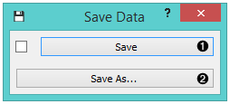
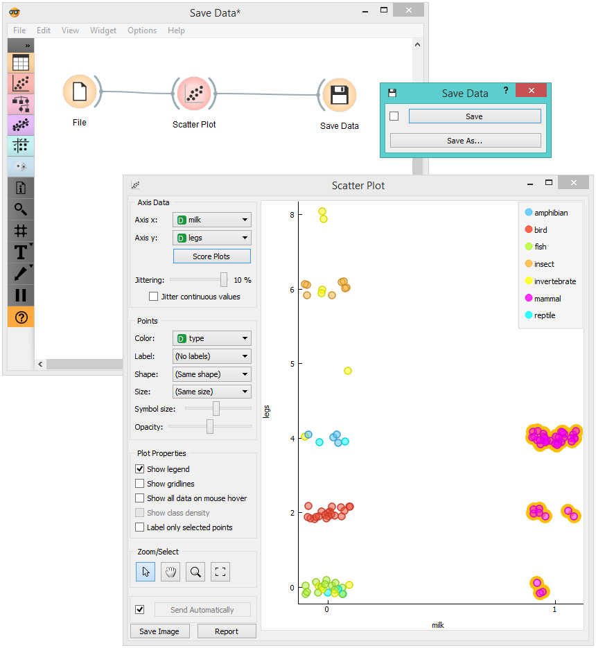

Save Data
=========

Saves data to a file.

**Inputs**

- Data: input dataset

The **Save Data** widget considers a dataset provided in the input channel and saves it to a data file with a specified name. It can save the data as a tab-delimited or a comma-separated file.

The widget does not save the data every time it receives a new signal in the input as this would constantly (and, mostly, inadvertently) overwrite the file. Instead, the data is saved only after a new file name is set or the user pushes the *Save* button.

1. Save by overwriting the existing file.
2. *Save as* to create a new file.

Example
-------

In the workflow below, we used the *Zoo* dataset. We loaded the data into the [Scatter Plot](../visualize/scatterplot.md) widget, with which we selected a subset of data instances and pushed them to the **Save Data** widget to store them in a file.

