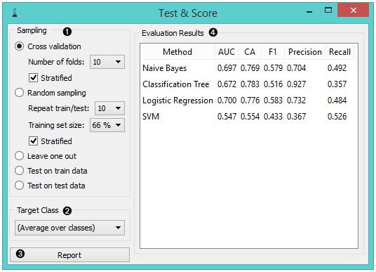
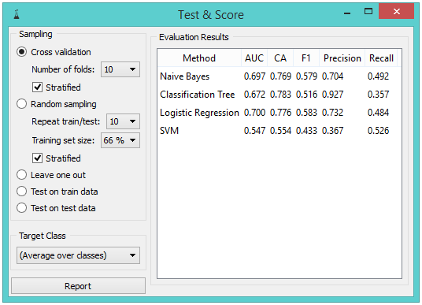
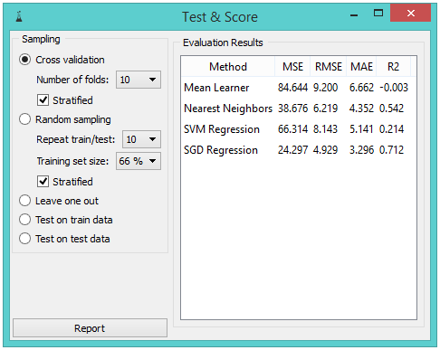
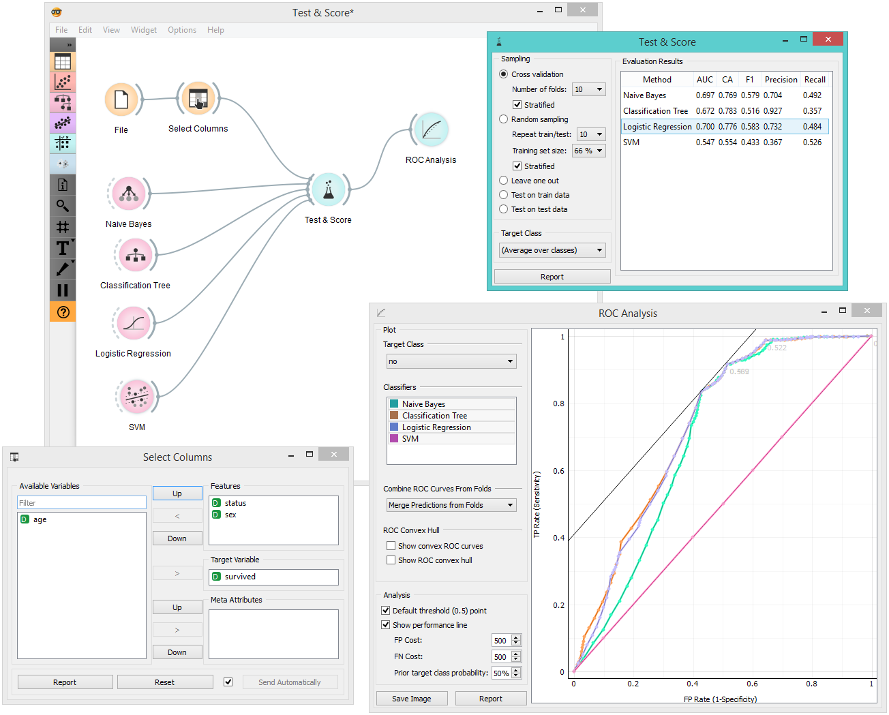

Test and Score
==============

Tests learning algorithms on data.

**Inputs**

- Data: input dataset
- Test Data: separate data for testing
- Learner: learning algorithm(s)

**Outputs**

- Evaluation Results: results of testing classification algorithms

The widget tests learning algorithms. Different sampling schemes are available, including using separate test data. The widget does two things. First, it shows a table with different classifier performance measures, such as [classification accuracy](https://en.wikipedia.org/wiki/Accuracy_and_precision) and [area under the curve](https://en.wikipedia.org/wiki/Receiver_operating_characteristic#Area_under_the_curve). Second, it outputs evaluation results, which can be used by other widgets for analyzing the performance of classifiers, such as [ROC Analysis](../evaluate/rocanalysis.md) or [Confusion Matrix](../evaluate/confusionmatrix.md).

The *Learner* signal has an uncommon property: it can be connected to more than one widget to test multiple learners with the same procedures.

1. The widget supports various sampling methods.
   - [Cross-validation](https://en.wikipedia.org/wiki/Cross-validation_\(statistics\)) splits the data into a given number of folds (usually 5 or 10). The algorithm is tested by holding out examples from one fold at a time; the model is induced from other folds and examples from the held out fold are classified. This is repeated for all the folds.
   - **Leave-one-out** is similar, but it holds out one instance at a time, inducing the model from all others and then classifying the held out instances. This method is obviously very stable, reliable... and very slow.
   - **Random sampling** randomly splits the data into the training and testing set in the given proportion (e.g. 70:30); the whole procedure is repeated for a specified number of times.
   - **Test on train data** uses the whole dataset for training and then for testing. This method practically always gives wrong results.
   - **Test on test data**: the above methods use the data from *Data* signal only. To input another dataset with testing examples (for instance from another file or some data selected in another widget), we select *Separate Test Data* signal in the communication channel and select Test on test data.
2. For classification, *Target class* can be selected at the bottom of the widget. When *Target class* is (Average over classes), methods return scores that are weighted averages over all classes. For example, in case of the classifier with 3 classes, scores are computed for class 1 as a target class, class 2 as a target class, and class 3 as a target class. Those scores are averaged with weights based on the class size to retrieve the final score.
3. Produce a report.
4. The widget will compute a number of performance statistics, which can be shown or hidden by right-clicking the columns:
   - Classification
   
        - [Area under ROC](http://gim.unmc.edu/dxtests/roc3.htm) is the area under the receiver-operating curve.
        - [Classification accuracy](https://en.wikipedia.org/wiki/Accuracy_and_precision) is the proportion of correctly classified examples.
        - [F-1](https://en.wikipedia.org/wiki/F1_score) is a weighted harmonic mean of precision and recall (see below).
        - [Precision](https://en.wikipedia.org/wiki/Precision_and_recall) is the proportion of true positives among instances classified as positive, e.g. the proportion of *Iris virginica* correctly identified as Iris virginica.
        - [Recall](https://en.wikipedia.org/wiki/Precision_and_recall) is the proportion of true positives among all positive instances in the data, e.g. the number of sick among all diagnosed as sick.
   - Regression
   
      - [MSE](https://en.wikipedia.org/wiki/Mean_squared_error) measures the average of the squares of the errors or deviations (the difference between the estimator and what is estimated).
      - [RMSE](https://en.wikipedia.org/wiki/Root_mean_square) is the square root of the arithmetic mean of the squares of a set of numbers (a measure of imperfection of the fit of the estimator to the data)
      - [MAE](<https://en.wikipedia.org/wiki/Mean_absolute_error>) is used to measure how close forecasts or predictions are to eventual outcomes.
      - [R2](<https://en.wikipedia.org/wiki/Coefficient_of_determination>) is interpreted as the proportion of the variance in the dependent variable that is predictable from the independent variable.
5. Choose the score for pairwise comparison of models and the region of practical equivalence (ROPE), in which differences are considered negligible.
6. Pairwise comparison of models using the selected score (available only for cross-validation). The number in the table gives the probability that the model corresponding to the row is better than the model corresponding to the column. If ROPE is enabled, the smaller number below shows the probability that the difference between the pair is negligible. The test is based on the Bayesian interpretation of the t-test; (paper: https://link.springer.com/article/10.1007/s10994-015-5486-z,16-305.html, shorter introduction: https://baycomp.readthedocs.io/en/latest/introduction.html).

Example
-------

In a typical use of the widget, we give it a dataset and a few learning algorithms and we observe their performance in the table inside the **Test & Score** widget and in the [ROC](../evaluate/rocanalysis.md). The data is often preprocessed before testing; in this case we did some manual feature selection ([Select Columns](../data/selectcolumns.md) widget) on *Titanic* dataset, where we want to know only the sex and status of the survived and omit the age.

Another example of using this widget is presented in the documentation for the [Confusion Matrix](../evaluate/confusionmatrix.md) widget.
